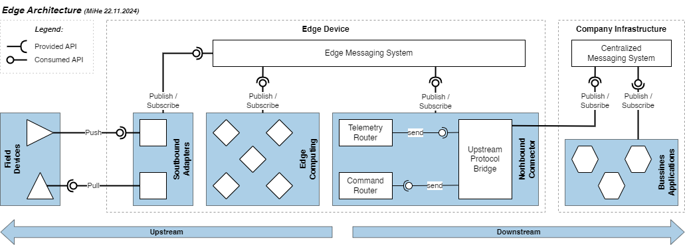

# IIoT Connector Box – Skalierbarer Retrofit Baukasten für die Industrie 4.0
## Einleitung
Die Digitalisierung der industriellen Produktion schreitet rasant voran, und Unternehmen stehen vor der Herausforderung, bestehende Maschinenparks in smarte, vernetzte Systeme zu integrieren. Doch wie gelingt der Schritt vom klassischen Maschinenpark zur datengesteuerten Fabrik, ohne dabei in kostspielige Neuanschaffungen zu investieren? Hier kommt das Konzept der IIoT Connector Box ins Spiel – ein skalierbarer Retrofit-Baukasten, der bestehende brownfield Anlagen schnell und effizient in das Zeitalter des Industrial Internet of Things (IIoT) bringt.

In diesem Blogbeitrag erfahren Sie meinen Lösungsansatz, wie ein Edge Device als Herzstück der Lösung fungiert, um Maschinendaten zu erfassen, zu verarbeiten und in Echtzeit an zentrale Systeme oder die Cloud weiterzuleiten. Wir werfen einen Blick auf die allgemeinen zugrunde liegende Struktur bei der Umsetzung der Maschinen Datenerfassung, eine konkrete Mögliche Umsetzungsvariante und die verwendeten Technologien und wie eine flexible und modulare Architektur Unternehmen dabei unterstützt, ihre Digitalisierung mit minimalem Aufwand zu skalieren.

Lassen Sie uns die Welt der IIoT Connector Box gemeinsam entdecken und die Möglichkeiten für eine smarte und zukunftsfähige Produktion ausloten!

## Architekturentscheidungen und Business Anforderungen im Fokus
Die erfolgreiche Umsetzung eines IIoT-Projekts beginnt mit den grundlegenden Architekturentscheidungen. Diese legen nicht nur die Basis für die technische Umsetzung, sondern beeinflussen auch nachhaltige und zukunftssichere Infrastruktur die zum Unternehmen passen. Den hier liegt meiner Meinung nach der Knackpunkt, jedes Unternehmen hat seine eigene IT Umgebung und Anforderungen, so wie ihre eigenes Applikations-Ecosystem das es im Einsatz hat, dies gilt es zu berücksichtigen. Im Idealfall kann man auf bereits eingesetzten und bekannte Systeme aufbauen wenn es darum geht die Maschinendaten zu verarbeiten und zu visualisieren. Auch die Anforderungen an das OT Netzwerk und die Sicherheit sind entscheidend bei der Auswahl der passenden Architektur. Hier gibt es sicherlich Gemeinsamkeiten in den Einsatzgebieten, doch oft liegt der Teufel im Detail und kann Branchen abhängig variieren.

Bei der Auswahl einer passenden Lösung zur Maschinen-Datenerfassung stehen meiner Meinung nach vor allem folgende Fragestellungen im Vordergrund die man sich stellen sollte:
1. Welche Abhängigkeiten möchte man eingehen? _Möchte man abhängig von einem der grossen Cloud Anbieter sein, ist man bereit Lizenzen zu zahlen, möchte man gebunden sein an einer der Vielen IIoT Platform Anbieter oder setzt mal voll auf Open Source?_
2. Möchte man eine "Out of the box" Lösung oder eine individuelle Lösung?
3. Welche Architektur Qualität Anforderungen sind wichtig in meinem Umfeld? 
4. Wo werden die Produktionsdaten, Fertigungs- und Auftragsdaten mit den Maschinendaten zusammengeführt? _In der Cloud, im eigenen Rechenzentrum oder auf einem Edge Device?_
5. Wo sollen die Insights generiert werden und welchen Nutzen kann ich daraus ziehen?
6. Welchen Messintervalle sind für meine Use Cases sinnvoll? _Reicht es aus wenn die Daten alle 5 Minuten oder mehr zu erfassen oder muss es jede Sekunde oder weniger sein? Ist es allenfalls sinnvoller am edge Daten zu dezimieren oder eine datenaufbereitung durchzuführen?_
7. Muss ich auf den erlangten Insights reagieren können? _Müssen dies direkten Einfluss auf den Produktionsprozess haben oder Benachrichtigungen wie Events an weitere Systeme ausgelöst werden?_
8. Wie schnell muss man bezogen auf Insights reagieren können? _Reicht es aus wenn die Daten einmal am Tag verarbeitet werden oder muss es in Echtzeit sein?_
9. Welche Systeme und tools setzt man bereits ein und wie gut können diese in die neue Lösung integriert werden? _Ist man bereit neues zu lernen, neue Systeme einzuführen und neue Prozesse zu etablieren?_

> Man muss sich im klaren sein, das es die «one fits it all» Lösung nicht gibt. Bei der Auswahl der für sich passenden Lösung sollte man nüchtern und realistisch an die Sache herangehen. Vor allem soll sie die Anforderung und Bedürfnisse des Unternehmens erfüllen und nicht umgekehrt.

Ein weiteres hilfsmittel für die Entscheidungsfindung sind Architektur Qualitätsmerkmale zum Beispiel nach _ISO 25010 [1]_. Diese können dabei helfen, Entscheidungen zu treffen. Dabei definiert man drei bis fünf Merkmalen die für das Projekt am wichtigsten sind. Diese können zum Beispiel für die angestrebte Edge Lösung folgende sein:

1. **Erweiterbarkeit** - Es ist leicht, neue Funktionalität hinzuzufügen und die Lösung zu erweitern.
2. **Austauschbarkeit** - Die Lösung ist Modular aufgebaut und es können einzelne Teile daraus durch andere ersetzt werden, ohne dass dies zu großen Problemen führt.
3. **Sicherheit** - Die Lösung ist sicher und schützt die Daten vor unbefugtem Zugriff.
4. **Korrektheit** - Die erfassten Informationen bilden die Realität ab
5. **Zuverlässigkeit** - Die Lösung ist zuverlässig und funktioniert auch unter schwierigen Bedingungen.

Ich möchte hier nicht weiter ins Detail gehen, doch es ist wichtig sich im klaren zu sein, welche Qualitätsmerkmale und Ansprüche es an die Lösung gibt.  

## Betrachtung einer möglichen Edge Architektur
Als Vorbereitung auf diesen Blogbeitrag habe ich mir Gedanken gemacht, wie eine mögliche Edge Architektur für die Maschinendatenerfassung aussehen könnte. Dabei habe ich mich auf meine bereits gemachten Erfahrungen und das betrachten von unterschiedlichen IIoT Platform Lösungen gestützt. Meiner Ansicht nach, enthält eine Edge Lösung im grunde immer ähnliche zentrale Komponenten. Sie werden zwar je eingesetzten Technologien oder Anbieter unterschiedlich umgesetzt, enthalten jedoch die selben Merkmale. In folgender Abbildung habe ich versucht meine Sicht der Dinge vereinfacht darzustellen: 

Wie in der Abbildung ersichtlich, sind 3 zentrale Domänen zu erkennen: Die `Field Devices` links, das `Edge Device` in der Mitte und die `Company Infrastructure` rechts. Das können Beispielsweise Fertigungsmaschinen sein, also die Quelle der Daten, die es zu erfassen gilt. Das Edge Device ist das Herzstück der Lösung, das die Daten erfasst, verarbeitet und an die Unternehmensinfrastruktur weiterleitet. Die Unternehmensinfrastruktur ist der Ort, an dem die Daten verarbeitet, analysiert und in bestehende Systeme integriert werden. Allenfalls sollen auch Kommandos an die Maschinen oder an das Edge Device zurückgegeben werden. Der Primäre `Downstream` Kommunikationskanal in dieser Architektur ist in Richtung Company Infrastructure gerichtet, also primär das versenden der Telemetry Daten. In Richtung Upstream, also zum Edge Device und weiter zu den Field Devices, wird primär für wenige Steuer Kommandos und Konfigurationen genutzt. Es sei noch erwähnt, das der Einfachheit halber die Betrachtung von Authentication und Authorization, sowie die Sicherheit der Kommunikation nicht berücksichtigt wurde. Diese sind jedoch essentiell und müssen in einer realen Umsetzung berücksichtigt werden.

- **Maschinen** - Hier kann einem beinahe alle Arten von Protokolle und Schnittstellen erwarten. Da die Maschinen Hersteller oft eigene proprietäre Protokolle verwenden. Seit einigen Jahren hat sich jedoch der Standard OPC UA etabliert, welches durch das Industrie Consortium _OPC Foundation [2]_ standardisiert wird. Dieser ermöglicht es, Maschinen verschiedener Hersteller miteinander zu verbinden. Dies erlaubt auch eine einheitliche Schnittstellen für die Maschinendatenerfassung unter anderem durch Companion Spezifikationen. Die Weiterentwicklung durch die _OPC UA Part 14 PubSub Spezifikation [3]_ ermöglicht es, Daten in Echtzeit zu erfassen und zu verarbeiten, weiter ist es auch ein Paradigma Wechsel von Pull zu Push. Bei Brown Field Szenarien ist es jedoch oft nicht möglich, die Maschinen direkt mit OPC UA zu verbinden. 
- **Southbound Adapters** - Um eine Kommunikation mit den unterschiedlichsten Geräte und Protokollen zu ermöglichen, ist der Einsatz von entsprechenden Adapter notwendig. Diese können den Datenaustausch ermöglichen und in ein gewünschtes Format überführen. Dabei greift man am besten auf Dritt Hersteller Lösungen zurückzugreifen, als beispiel sei hier _Softing Industrial [4]_ genannt. Ausserordentlich Interessant finde ich das Angebot von Docker Container die sie `edgeConnector` nennen.
- **Edge Messaging System** - Das Edge Messaging System ist die zentrale Komponente, die die Kommunikation der unterschiedlichen Applikationen auf dem `Edge Device` ermöglicht. Mann kann es auch als implementierungsdetail betrachten, trotzdem kann es einem helfen Informationen einfach zwischen den lokalen Applikationen auszutauschen. Hier gibt es sehr viele Möglichkeiten was zum Einsatz kommen kann. Wenn man auf einen Queuing Mechanismus verzichten kann, wird vermehrt auf einen MQTT Broker gesetzt, zum Beispiel _Eclipse Mosquitto [5]_.
- **Edge Computing** - Hier spricht man von verschiedenen Applikationen die auf dem Edge Device laufen. Diese können einfache Aggregationen und Filterungen und bis hin zu Machine Learning Modellen reichen. Hier ist es wichtig, dass die Applikationen modular und flexibel aufgebaut sind, um die Anforderungen an die Maschinendatenerfassung zu erfüllen. Das Edge Messaging System spielt hier eine wichtige Rolle, um die Kommunikation zwischen den Applikationen zu vereinfachen.
- **Northbound Connector** - Hier spiegelt sich die Konnektivität zu dem Übergelagerten System, also der Northbound, ab. Der Datenaustausch in beide Richtungen wird hier abgewickelt. Die kontinuierlichen Telemetry Daten werden hier, entsprechend dem gewählten Protokoll und der Anforderungen an die Datenübertragung, versendet. Ausserdem können hier auch Steuerungskommandos abgerufen werden um sie an die Field Devices weiterzuleiten.
- **Centralized Messaging System** - Sinnvoll ist ein zentrales Messaging System einzusetzen. Dies hilft bei, weitere Verarbeitung der Daten, wie zum Beispiel das Speichern in einer Datenbank oder das Weiterleiten an andere System. In letzte Zeit wird hier oft von einem Unified Namespace (UNS) gesprochen. Dieser Begriff wurde durch  _Walker Reynolds [6]_ geprägt und beschreibt eine zentrale Struktur des Unternehmensgeschäfts und alle Ereignisse. Es beschreibt unter anderem die Stelle an dem der aktuelle Stand des Unternehmens lebt, also der Knotenpunkt, über den die Intelligenten Dinge im Unternehmen miteinander kommunizieren. Mann kann es auch als eine Art des Digitalen Zwilling sehen.
- **Business Applications** - Hier werden die Daten weiterverarbeitet und in bestehende Systeme integriert. Dies können ERP-Systeme, MES-Systeme, SCADA-Systeme, Datenverarbeitung-Systeme, Ablage in einen Data Lake Alarmierung-Systeme, ... und so weiter sein. Es kommt dabei auf die Anforderungen des Unternehmens an, welche Systeme integriert werden müssen und sinnvoll sind.

Ich möchte dabei speziell betonen, dass das zu wählende Datenformat, zumindest auf der Seite der Company Infrastructure, einheitlich sein sollte. Dies erleichtert die Integration in bestehende Systeme und ermöglicht eine effiziente Verarbeitung der Daten. Hierbei kann es sich zum Beispiel um einheitliche Datenformate wie JSON, Parquet oder Avro handeln. Idealerweise definieren sie ein vorab definiertes Model welches über Schemavalidierung geprüft werden kann. 

## Die Umsetzung darf nicht klein geredet werden
Die Übersicht einer Edge Architektur möchte ich abschliessend mit ein Paar Gedanken zur Umsetzung einer Maschinen Anbindung. Denn in der Realität dies oft komplexer als anfangs angenommen. 

Es gibt viele **organisatorische Herausforderungen**, die es zu meistern gilt. Der eine Aspekt ist das oft viele unterschiedliche Parteien mit involviert sind. Fangen wir bei der Maschine an, hier ist allenfalls der Maschinen Hersteller der eine passende Schnittstelle bereitstellt oder bei einer älteren Anlage greift man einige Signale direkt im Schaltschrank ab oder montierte zusätzliche Sensoriken, was dazu führt, dads Mechanisches Talent gefragt wird, der Elektriker oder Automatiker verdrahtet die Signale dann Elektronisch. Der IIoT-Engineer verantwortet das Edge Device und die Applikationen die darauf laufen. Es benötigt einen Netzwerktechniker der die Freigabe im OT Netzwerk ermöglicht. Weiter kann es beim Sammeln von Daten dazu führen das ein Datenanalyst und Daten-Engineer involviert ist um diese Daten zu verarbeiten. Sollte noch eine Applikation entwickelt werden, um die eine passende Visualisierung zu bewerkstelligen, ist ein Frontend Developer notwendig. Läuft dann die Infrastruktur allenfalls in einer Private Cloud, ist ein Cloud Developer und auch noch das Cloud Operations Team mit involviert. Spätestens in diesem moment, wird dan oft der Enterprise Architekt und Data Architekt hellhörig und will sicherstellen das die Architektur den Unternehmens Anforderungen entspricht. Sollte es dan noch ERP Anbindungen geben, ist sicherlich auch ein weiteres Team involviert. Und wie wird das dann mit der Security und den Compliance Anforderungen geregelt? Dabei habe ich die wichtigste Partei der Stakeholder wie Lean-Manger, Produktionsleiter, Fertigungsleiter oder Teamleiter noch gar nicht erwähnt.

Eine gute **Kommunikation kann schwierig sein**. Bei so vielen möglichen Parteien kann dies schnell zu Unklarheiten und Unverständnis führen. Es sollte darauf geachtet werden, dass kein Gärtchen Denken entsteht und alle Beteiligten an einem Strang ziehen. Sollte es zu einem «Das ist dein Problem» denken kommen, wird nicht mehr miteinander gesprochen, dies verzögert eine Umsetzung unnötig. Gerade mit den unterschiedlichen Fachbereichen und deren unterschiedlichen Sprachen kann dies zu Fach-Barrieren führen. Hier kann ein Mittelsmann oder Dolmetscher zwischen den Beteiligten weiterhelfen.

Wichtig ist eine **vorhandene und klare Anforderung**. Ist ein IIoT Projekt nicht klar Business getrieben und nicht Werte orientiert gerichtet, verliert man sich sehr schnell in unbedeutenden und unnötigen Technischen Details. Dies kann teuer werden in der Umsetzung und führt oft zu einem unzufriedenen Endresultat. Mein Tipp hier ist: 
1. Klein starten und wachsen
2. Die richtigen Fragen stellen: Das warum und was beantworten
3. Schnell Wert generieren

> «Digitalisierung ist eine Reise und nicht ein Projekt. Klein starten und wachsen mit wertvollen Ergänzungen»

Es ist nicht mein Anliegen Angst zu schüren, einfach nur übertrieben realistisch darzulegen, was einem erwarten kann. Es muss aber nicht in jedem Fall so sein!

## Eine mögliche Umsetzungsvariante
Bisher habe ich mich auf allgemeine Überlegungen und Entscheidungen konzentriert. Doch wie könnte eine konkrete Umsetzung einer IIoT Connector Box aussehen? Da ich gerne praktisch denke, mache ich auch gerne praktische Vorschläge. Der folgende Vorschlag basiert auf persönlichen Präferenzen. Es zeigt vielleicht auch auf, dass es wie bereits erwähnt, nicht die «one fits it all» Lösung gibt.

In dieser Beispiel Variante zeige ich, wie man in einem Brown Field Szenario, einfache Maschinen Signale mit einem Edge Device erfassen und an eine zentrale Infrastruktur, in diesem Fall Azure Cloud, weiterleiten kann. Der Einfachheit halber ist nur ein unidirektionaler Weg aufgezeigt. Dies lässt sich natürlich wahlweise erweitern. Das Komplette Code Beispiel ist auf meinem _GitHub Repository [7]_ zu finden.

> ❓❓❓ ToDo: Abbildung Edge Lösung

> ❓❓❓ ToDo: Beschreiben der Komponenten

## Fazit

> «Technologie alleine bringt noch keinen Vorteil. Als erstes braucht es die Aufgabenstellung (Problem) und den passenden Use Case dazu. Danach kommt die Lösung.»

tbd

ich hoffe ich konnte:
zum denken angeregt
ein übersicht verschaft
eine mögliche lösung präsentiert

- _[1] ISO 25010 System and software quality models (https://iso25000.com/index.php/en/iso-25000-standards/iso-25010)_
- _[2] OPC Foundation (https://opcfoundation.org)_
- _[3] OPC UA PubSub Spezifikation (https://reference.opcfoundation.org/Core/Part14/docs/)_
- _[4] Softing Industrial (https://softing.com)_
- _[5] Eclipse Mosquitto (https://mosquitto.org)_
- _[6] Walker Reynolds (https://www.linkedin.com/in/walkerdreynolds/)_
- _[7] Beispiel Code auf GitHub (https://github.com/bqstony/blog-iiot-connector-box)_
- _[x] RabbitMQ Shovel Plugin (https://www.rabbitmq.com/shovel.html)_
- _[y] Blog: Importing Data from RabbitMQ into Azure Data Explorer via Event Hubs (https://techcommunity.microsoft.com/blog/azuredataexplorer/importing-data-from-rabbitmq-into-azure-data-explorer-via-event-hubs/3777688)_
- _[z] Microsoft Learn: How to integrate Service Bus with RabbitMQ (https://learn.microsoft.com/en-us/azure/service-bus-messaging/service-bus-integrate-with-rabbitmq)_
- _[a] Linux®-basierte Echtzeitsteuerung mit TwinCAT (https://www.beckhoff.com/de-ch/produkte/produktneuheiten/linux-r/)_
