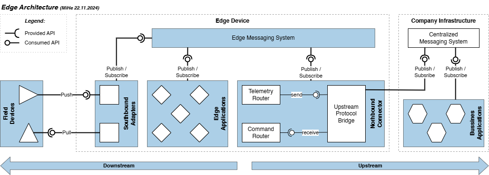

# IIoT Retrofit für Brownfield: Die skalierbare Connector Box für Industrie 4.0
## Einleitung
Die Digitalisierung der industriellen Produktion schreitet rasant voran. Viele Unternehmen stehen dabei vor der Herausforderung, bestehende Maschinen und Anlagen in vernetzte, datengetriebene Prozesse zu integrieren, ohne den Maschinenpark vollständig zu erneuern. Genau hier setzt das Konzept der IIoT Connector Box an: als skalierbarer Retrofit-Baukasten für Brownfield-Umgebungen.

In diesem Blogbeitrag beleuchte ich die zentralen Business-Anforderungen und Architekturentscheidungen, die bei einer solchen Lösung im Vordergrund stehen. Anschliessend zeige ich, wie eine mögliche Edge-Architektur für die Maschinendatenerfassung aufgebaut sein kann, welche technischen Bausteine sich dafür eignen und welche unterschiedlichen Lösungsansätze sich in der Praxis anbieten. Ziel ist es, einen realistischen Überblick zu geben und Denkanstösse für eine modulare, erweiterbare und zukunftsfähige Umsetzung zu liefern.

## Business Anforderungen und Architekturentscheidungen im Fokus
Die erfolgreiche Umsetzung eines IIoT-Projekts beginnt mit den grundlegenden Architekturentscheidungen. Diese können jedoch nicht getroffen werden, ohne vorher die Business Anforderungen zu kennen. Den ohne konkretisierte, festgehaltene qualitative Anforderungen so wie das ermitteln der Fachlichen Ziele, ist eine Software Architektur nur die hälfte Wert. Den nur was dem Business am Ende einen Mehrwert bietet, macht überhaupt sind, in Software zu giessen. Sobald dieses Verständnis vorhanden ist, kann die technische Grundlage geschaffen werden, um eine nachhaltige und zukunftssichere IIoT Infrastruktur zu entwerfen, die zum Unternehmen passt. Also einfach gesagt: `Wir müssen wissen, was das Business eigentlich wirklich will!`

Jedes Unternehmen hat seine eigene IT Umgebung, Anforderungen und Compliance die es zu berücksichtigen gilt. So wie ihr eigenes Applikation-Ecosystem, dass bereits im Einsatz ist. Im Idealfall kann man auf bereits eingesetzten, bekannte und funktionierende Systeme aufbauen. Wenn es darum geht, die Anlagedaten zu erfassen, zu visualisieren, zu verarbeiten und aus den gewonnen Daten Mehrwert zu generieren um diese wieder zurück in die Arbeitsprozesse einfliessen zu lassen. Auch die Anforderungen an das OT Netzwerk und die Sicherheit sind entscheidend bei der Auswahl der passenden Lösung. Hier gibt es sicherlich Gemeinsamkeiten aus der bestehenden IT Umgebung die übernommen werden können. Doch oft liegt der Teufel im Detail, denn es sind doch unterschiedliche Anforderungen vorhanden.

Bei der Auswahl einer passenden technischen Lösung zur Maschinen-Datenerfassung stehen folgende Fragestellungen im Vordergrund die man sich stellen sollte:
1. Welche Abhängigkeiten möchte man eingehen? _Möchte man abhängig von einem der grossen Cloud Anbieter sein, ist man bereit Lizenzen zu zahlen, möchte man gebunden sein an einer der vielen IIoT Platform Anbieter oder setzt mal voll auf Open Source Baukasten und erweitert man diese mit Eigenentwicklungen?_
2. Möchte man eine "Out of the box" Lösung oder eine individuelle Lösung? _Obwohl nach meiner Meinung eine Brownfield Anbindung per se immer eine individuelle Lösung ist._
3. Was sind relevante Prozessdaten, die mir bei der Prozess Optimierung, Wartung, Instandhaltung und Planung unterstützen können? _Dies kann tatsächlich nicht so einfach beantwortet werden und bedingt allenfalls einem explorativen Ansatz._  
4. Welche Qualitäts-Anforderungen sind wichtig in meinem Umfeld? _Idealerweise beschreibt man diese durch Qualitätsszenarien_ 
5. Wo werden die Produktionsdaten, Fertigungs- und Auftragsdaten mit den Maschinendaten zusammengeführt? _Oft sind solche schnittstellen nicht oder nur mangelhaft vorhanden. Einzelne Silo Lösungen verhindern oft schnellen Mehrwert zu generieren da der Zugriff nicht gewährleistet ist. Als denkanstoss sei hier UNS [1] (Unified Namespace) welches stark von Walker Reynolds [2] geprägt wurde, als möglicher Lösungsansatz genannt._
6. Wo sollen die Insights generiert werden und welchen Nutzen kann ich daraus ziehen? _Der Nutzen ist ein zentraler Punkt der am besten vor der Umsetzung klar definiert wird._
7. Welchen Messintervalle sind für meine Use Cases sinnvoll? _Reicht es aus wenn die Daten alle 5 Minuten oder mehr zu erfassen oder muss es jede Sekunde oder weniger sein? Ist es allenfalls sinnvoller am edge Daten zu dezimieren oder eine datenaufbereitung eventuell Statistik oder auch mit ML durchzuführen? Hier kann man die Business Anforderungen und Qualitätsanforderung zücken um die richtige Entscheidung zu treffen._
8. Muss ich auf den erlangten Insights reagieren können und wie schnell soll das geschehen? _Ist ein direkter Einfluss auf den Produktionsprozess notwendig oder sollen Benachrichtigungen wie Events an weitere Systeme ausgelöst werden? Auch hier geben die Business Anforderungen die Antwort._
9. Welche Systeme und tools setzt man bereits ein und wie gut können diese in die neue Lösung integriert werden? _Ist man bereit neues zu lernen, neue passendere Systeme einzuführen und neue Prozesse zu etablieren?_

> Man muss sich im klaren sein, dass es die «one fits it all» Lösung nicht gibt. Bei der Auswahl der passenden Lösung sollte man nüchtern und realistisch an die Sache herangehen. Vor allem soll sie die Anforderung und Bedürfnisse des Business erfüllen und nicht umgekehrt.

Ein gutes hilfsmittel für die Findung von Qualitätsmerkmale kann zum Beispiel die _ISO 25010 [3]_ sein. Sie kan dabei helfen, auf welche Merkmale zu achten ist. Dabei definiert man drei bis fünf top Qualitative Merkmalen die für das Projekt am wichtigsten sind. Diese können zum Beispiel für die angestrebte IIoT Connector Box Lösung folgende sein:

1. **Erweiterbarkeit** - Es ist leicht, neue Funktionalität hinzuzufügen und die Lösung zu erweitern.
2. **Austauschbarkeit** - Die Lösung ist Modular aufgebaut und es können einzelne Teile daraus durch andere ersetzt werden, ohne dass dies zu großen Problemen führt.
3. **Sicherheit** - Die Lösung ist sicher und schützt die Daten vor unbefugtem Zugriff.
4. **Korrektheit** - Die erfassten Informationen bilden die Realität ab
5. **Zuverlässigkeit** - Die Lösung ist zuverlässig und funktioniert auch unter schwierigen Bedingungen.

Der nächste Schritt ist noch wichtiger, die Qualitätsszenarien definieren und die Anforderungen vom Business klar festzuhalten. Ich möchte hier jedoch nicht noch weiter ins Detail gehen, doch es ist wichtig sich im klaren zu sein, welche Ansprüche es an die Lösung gibt. Es liegt in der Natur der Sache, dass es sich bei der Umsetzung einer IIoT Connector Box sehr viel um Schnittstellen und Integration dreht. Zwischen der Maschine mit den deren Prozessen und dem Team von Menschen welche diese beaufsichtigen und den betreuen, dem Edge Device welche die Daten verarbeitet, bis hin zur Unternehmensinfrastruktur und Business Prozesse welche in ihren bestehenden Systemen integriert werden soll wie ERP, SAP, EWM, WMS, MES, SCADA, EWM, usw...

> Jedoch nochmals klar gesagt, die Business Anforderungen sind die Basis und der Grund warum wir überhaupt eine Lösung suchen. Die Technologie ist nur das Mittel zum Zweck und sollte nicht im Vordergrund stehen!

## Betrachtung einer IIoT Edge Device Architektur
Als Vorbereitung auf diesen Blogbeitrag habe ich mir Gedanken gemacht, wie eine mögliche Edge Architektur für die Maschinendatenerfassung aussehen könnte. Dabei habe ich mich auf meine bereits gemachten Erfahrungen und das betrachten von unterschiedlichen IIoT Platform Lösungen gestützt. Meiner Ansicht nach, enthält eine Edge Lösung im Grunde immer ähnliche zentrale Komponenten. Sie werden zwar je eingesetzten Technologien oder Anbieter unterschiedlich umgesetzt, enthalten jedoch die selben Merkmale. In folgender Abbildung habe ich versucht meine Sicht der wesentlichen Komponenten, vereinfacht darzustellen: 

Wie in der Abbildung ersichtlich, sind 3 zentrale Domänen zu erkennen: Die `Field Devices` links, das können Beispielsweise Fertigungsmaschinen sein oder Sensoren bei einer Huckepack Lösung, also die Quelle. Das `Edge Device`, welches das Herzstück der Lösung ist, dass als Brücke zwischen Feld (OT) und der Unternehmensinfrastruktur IT dient _[4]_. Die `Company Infrastructure` rechts, ist der Ort, an dem in der Regel die Daten mit den Business Prozessen verschmolzen werden. Allenfalls sollen auch Kommandos an die Maschinen oder an das Edge Device zurückgegeben werden. Der Primäre Upstream Kommunikationskanal in dieser Übersicht ist in Richtung Company Infrastructure gerichtet, also primär das versenden der Telemetry Daten. In Richtung Downstream, also zum Edge Device und weiter zu den Field Devices, wird für wenige Steuer Kommandos und Konfigurationen genutzt. Es sei noch erwähnt, dass der Einfachheit halber die Sicherheit, Integrität oder auch für den Betrieb notwendige Komponenten nicht berücksichtigt wurden. Diese sind jedoch essentiell und müssen in einer Produktive Umsetzung berücksichtigt werden.

- **Field Devices** - Hier kann einem beinahe alle Arten von Hardware und verwendeten Protokollen und Schnittstellen erwarten. Gerade Automation Hersteller verwenden hier oft eigene proprietäre Protokolle. Seit einigen Jahren hat sich jedoch der Standard OPC UA etabliert, welches durch das Industrie Consortium _OPC Foundation [5]_ standardisiert wird. Dieser ermöglicht es, Maschinen verschiedener Hersteller miteinander zu verbinden. Dies erlaubt auch eine einheitliche Schnittstellen für die Maschinendatenerfassung unter anderem durch Companion Spezifikationen. Die Weiterentwicklung durch die _OPC UA Part 14 PubSub Spezifikation [6]_ ermöglicht es, Daten in Echtzeit zu erfassen und zu verarbeiten, weiter ist es auch ein Paradigma Wechsel von Pull zu Push. Bei Brown Field Szenarien ist es jedoch oft nicht möglich, die Maschinen direkt mit OPC UA zu verbinden. Ein weiterer, in den letzten Jahren stark verbreiter Standard ist MQTT, welches durch die _OASIS Open [7]_ standardisiert wird. Es ist ein leichtgewichtiges Protokoll, das für die Kommunikation zwischen Geräten und Anwendungen in der Industrie 4.0 geeignet ist. Das verstehen und integrieren kann gerade in Brown Field Szenarien eine Herausforderung sein, den notwendigen Aufwand sollte man nicht unterschätzen.
- **Southbound Adapters** - Um eine Kommunikation zwischen den Geräte Protokollen und dem Edge System zu ermöglichen, ist der Einsatz von passenden Adapter notwendig. Diese helfen von einem Format ins andere zu überführen. Hier greift man wenn immer möglich auf bereits bestehende Lösungen zurück, seien diese Open Source oder von einem kommerziellen Anbieter. Als Beispiele sei hier _Neuron [8]_, _edgeConnector von Softing Industrial [9]_, _OPC Foundation Cloud initiative mit Projekten wie UA Cloud Publisher und UA Cloud Commander [10]_, _opc-router von inray Industriesoftware GmbH [11], oder auch _Node-Red mit entsprechendem Plugin [12]_ genannt. 
- **Edge Messaging System** - Das Edge Messaging System ist die zentrale Komponente, welche die Kommunikation der unterschiedlichen Applikationen auf dem `Edge Device` ermöglicht. Mann kann es auch als implementierungsdetail betrachten, trotzdem kann es einem helfen Informationen einfach zwischen den lokalen Applikationen auszutauschen. Gerade bei der Datenerfassung fallen oft hohe Datenmengen an die als Stream am einfachsten zu verarbeiten sind. Auch hier hat sich in den letzten Jahren MQTT als Alltagswerkzeug etabliert. Ein wesentlichen Vorteil sehe ich in der einfachen Sichtbarkeit der vorliegenden Informationen durch das verbinden eines MQTT Clients wie _MQTTX [13]_ der den gesamten Datenfluss problemlos sichtbar macht. Spannende Beispiele für Brocker welche MQTT v5 unterstützen oder Plugins dafür bereitstellen sind: _Eclipse Mosquitto [14]_, _NanoMQ [15], _EMQX (Edge) [16]_, _HiveMQ Edge [17], oder _Kafka mit Plugin [18]_. Kann man darauf verzichten wären auch andere Messaging Systeme denkbar, wie zum Beispiel: _Nats [19], _RabbitMQ [20]_ und _Redis [21]_.
- **Edge Applications** - Hier positioniere ich die verschiedenen Applikationen die auf dem Edge Device ausgeführt werden. Alles was notwendig ist um den geforderten Business Case zu erfüllen. Diese können einfache Aggregationen, Filterungen, Dezimierungen, Erkennungen bis hin zu Machine Learning Modellen reichen. Ein gängiges Scenario sind Triggers die schnell auf Field Device Informationen reagieren sollen um eine bestimmte Aktion auszuführen wie Datenaufzeichnung starten oder jemanden zu informieren. Hier ist es wichtig, dass die Applikationen modular und flexibel aufgebaut sind. Das Edge Messaging System spielt hier eine wichtige Rolle, um die Kommunikation zwischen den Applikationen zu vereinfachen. Auch hier ist es sinnvoll, zuerst abzuklären ob es nicht bereits bestehende Lösungen für bekannte Problemstellungen gibt. Oft kann mit einer Rule Engine wie _eKuiper [22]_ oder einem Low Code Tool wie _Node-Red [12]_ bereits viel erreicht werden, diese geben eine gute Grundlage für die Weiterentwicklung einer individuellen Lösung. Gerade am Anfang wo es darum geht, schnell Mehrwert zu generieren und Field Devices besser zu verstehen. Während der Entwicklung und darüber hinaus, ist es sehr hilfreich Informationen besser zu verstehen in dem man diese sichtbar mach, dafür empfehle ich immer eine Time Series Datenbank wie _InfluxDB [23]_ in Kombination mit _Grafana [24]_ zu verwenden.
- **Northbound Connector** - Hier befindet sich die Schnittstelle zur Unternehmensinfrastruktur, also dem Northbound. Die im Edge verarbeiteten Telemetry Daten werden bestehenden Systemen bereitgestellt, damit diese weiterverarbeitet werden können. Durch Commandos können dritt Systeme Informationen zurück an das Edge bzw weiter an die Field Devices gesendet werden. Hier gibt es sicherlich viele Möglichkeiten, je nach den Anforderungen und der bestehenden Infrastruktur. Was bei air gapped Systemen sicherlich eine Herausforderung sein kann, aber auch bei in house Lösungen betrachtet werden sollte, ist das die Verbindung zum IT Netzwerk nicht immer gewährleistet ist. Es kann durchaus sein, dass die Daten über einen längeren Zeitraum lokal gespeichert werden müssen, bevor sie weitergeleitet werden können. Hier sollte man darauf achten, dass das gewählte Messaging System auch die Möglichkeit bietet, die Daten lokal für ein bestimmte Zeit zwischenzuspeichern, ohne dafür selber sorgen zu müssen.
- **Centralized Messaging System** - Sinnvoll ist ein zentrales Messaging System einzusetzen. Dies hilft bei der Weiterverarbeitung der Daten, wie zum Beispiel das Speichern in einer Datenbank oder das Weiterleiten an andere System. In letzte Zeit wird hier oft von einem _Unified Namespace (UNS) [1]_ gesprochen. Dieser Begriff wurde durch  _Walker Reynolds [2]_ geprägt und beschreibt eine zentrale Struktur des Unternehmensgeschäfts und alle Ereignisse. Es ist der Ort an dem der aktuelle Stand des Unternehmens lebt, also der Knotenpunkt, über den die Intelligenten Dinge im Unternehmen miteinander kommunizieren. Mann kann es auch als eine Art des Digitalen Zwilling sehen.
- **Business Applications** - Hier werden die Daten weiterverarbeitet und in bestehende Systeme integriert. Dies können ERP-Systeme, MES-Systeme, SCADA-Systeme, Datenverarbeitung-Systeme, Ablage in einen Data Lake Alarmierung-Systeme, ... und so weiter sein. 

**Datenformat:** 

Ich möchte dabei speziell betonen, dass das zu wählende Datenformat, einheitlich sein sollte. Dies erleichtert die Integration in bestehende Systeme und ermöglicht eine effiziente Verarbeitung der Daten. Gerade zum Start ist ein lesbares Format wie JSON hinsichtlich der Transparenz sehr hilfreich und kann mit _JSON Schema [25]_ auf Gültigkeit geprüft werden. Bei Grösseren Daten Blöcken kan man sehr gut auf das spaltenorientierte, schemabehaftete und komprimierte Datenformat _Parquet [26]_ zurückgreifen, welches von gängigen Datenverarbeitungs Tools unterstützt wird. 

Was ich auf keinen Fall vorenthalten möchte, dass sich in den letzten Jahren _Sparkplug [27]_ vermehrt etabliert hat, gerade im Zusammenhang mit _Unified Namespace (UNS) [28]_. Die breite Unterstützung hält sich jedoch immer noch in grenzen und ist auf einige, jedoch grosse Anbieter wie Beispielsweise _HiveMQ [29]_ beschränkt. Sparkplug B welches als Industriestandart gehandelt wird, basiert auf Version 2.2 und baut auf MQTT 3.1.1 auf, um Daten im industriellen Internet der Dinge (IIoT) zu strukturieren. Es definiert Namenskonventionen, Datenformate (Protobuf) und Zustandsüberwachung (Birth/Death Certificates), was die Integration von Sensoren und Geräten standardisiert, Interoperabilität verbessert und die Konfiguration vereinfacht. Die aktuelle Version 3.0 welche Ende 2022 erschienen ist, unterstützt nun auch MQTT v5, was zusätzliche Funktionen und Verbesserungen bietet. Es wird jedoch sicherlich noch zeit brauchen, bis diese Version in der Industrie weit verbreitet ist. 

## Die Umsetzung als eine Reise
Weiter möchte ich ein Paar Gedanken zur Projekt-Umsetzung mache. Denn in der Realität dies oft komplexer als anfangs angenommen. Es ist nicht mein Anliegen Angst zu schüren, einfach nur übertrieben realistisch darzulegen, was einem erwarten kann. Es muss aber nicht in jedem Fall so sein!

Es gibt viele **organisatorische Herausforderungen**, die es zu meistern gilt. Der eine Aspekt ist das oft viele unterschiedliche Parteien mit involviert sind. Fangen wir bei der Maschine an, hier ist allenfalls der Maschinen Hersteller der eine passende Schnittstelle bereitstellt oder bei einer älteren Anlage greift man einige Signale direkt im Schaltschrank ab oder montierte zusätzliche Sensoriken, was dazu führt, das Mechanisches Talent gefragt wird, der Elektriker oder Automatiker verdrahtet die Signale Elektronisch. Der IIoT-Engineer verantwortet das Edge Device und die Applikationen die darauf laufen. Es benötigt einen Netzwerktechniker der die Freigabe im OT/IT Netzwerk ermöglicht. Weiter kann es beim Sammeln von Daten dazu führen das ein Datenanalyst und Daten-Engineer involviert ist um diese Daten zu verarbeiten. Sollte noch eine Applikation entwickelt werden, um die eine passende Visualisierung zu bewerkstelligen, ist ein Frontend Developer notwendig. Läuft dann die Infrastruktur allenfalls in einer Private Cloud, ist ein Cloud Developer und auch noch das Cloud Operations Team mit involviert. Spätestens in diesem moment, wird dan oft der Enterprise Architekt und Data Architekt hellhörig und will sicherstellen das die Architektur den Unternehmens Anforderungen entspricht. Sollte es dan noch ERP Anbindungen geben, ist sicherlich auch ein weiteres Team involviert. Und wie wird das dann mit der Security und den Compliance Anforderungen geregelt? Dabei habe ich die wichtigste Partei der Stakeholder wie Lean-Manger, Produktionsleiter, Fertigungsleiter oder Teamleiter noch gar nicht erwähnt.

Eine gute **Kommunikation kann schwierig sein**. Bei so vielen möglichen Parteien kann dies schnell zu Unklarheiten und Unverständnis führen. Es sollte darauf geachtet werden, dass kein Gärtchen Denken entsteht und alle Beteiligten an einem Strang ziehen. Sollte es zu einem «Das ist dein Problem» denken kommen, wird nicht mehr miteinander gesprochen, dies verzögert eine Umsetzung unnötig. Gerade mit den unterschiedlichen Fachbereichen und deren unterschiedlichen Sprachen kann dies zu Fach-Barrieren führen. Hier kann ein Mittelsmann oder Dolmetscher zwischen den Beteiligten weiterhelfen. Zu beachten ist das von beginn weg ein klares commitment von allen Beteiligten vorhanden ist, damit die Umsetzung nicht ins stocken gerät.

Zentral ist eine **vorhandene und klare Business Anforderung**. Ist ein IIoT Projekt nicht klar Business getrieben und nicht Werte orientiert gerichtet, verliert man sich sehr schnell in unbedeutenden und unnötigen Technischen Details. Dies kann teuer werden in der Umsetzung und führt oft zu einem unzufriedenen Endresultat. Mein Tipp hier ist: 
1. Klein starten und wachsen
2. Die richtigen Fragen stellen wie: Warum machen wir das? Was wollen wir damit erreichen?
3. Schnell Wert generieren, auch wenn diese klein sein mögen
4. Fehler machen und daraus lernen, das gelernte mitnehmen und die Lösung weiterentwickeln
5. Sichtbarkeit schaffen, damit alle Beteiligten den Fortschritt sehen können und motiviert bleiben

> «Digitalisierung ist eine Reise und nicht ein Projekt. Klein starten und wachsen mit wertvollen Ergänzungen»

## Welche Lösungsansätze gibt es?
Doch wie könnte eine konkrete Umsetzung einer IIoT Connector Box aussehen? Die folgenden Vorschläge basieren auf persönlichen Präferenzen und lassen den Hardware Aspekt der Einfachheit aussen vor, da dies je nach Anwendungsfall variieren kann. Es zeigt auch auf, dass es wie bereits erwähnt, nicht die «one fits it all» Lösung gibt. Neben den hier aufgeführten out-of-the-box Lösungen kann man diese sicherlich auch als grundlage verwenden um eine einfachere und individuelle Lösungsvariante zu entwickeln. Grundsätzlich empfehle ich die Verwendung von Docker Containern, um die Applikationen auf dem Edge Device zu betreiben. Durch die Verwendung von unterschiedlichen Komponenten als Containern lässt sich die Lösung modular und flexibel gestalten und ermöglicht es, einzelne Komponenten nach Bedarf zu verwenden und mit weiteren zu erweitern. 

**Der Open Source Ansatz**

Eine gute Möglichkeit, eine IIoT Connector Box umzusetzen, ist die Verwendung von Open Source Lösungen. Die _LF Edge (Linux Foundation Edge) [30]_ ist eine Dachorganisation, deren Ziel es ist, einen offenen, interoperablen Rahmen für Edge-Computing zu schaffen, der unabhängig von Hardware, Chipsätzen, Cloud-Lösungen oder Betriebssystemen ist. Also die Ideale Adresse um eine passende Open Source Lösung zu finden. Wer sich bereits mit der Cloud native computing foundation auskennt, wird hier schnell parallelen finden und sich zurechtfinden.

Ein spannendes Projekt ist dabei _EdgeX Foundry [31]_, welches eine flexible und modulare Plattform für die Entwicklung von Edge-Computing-Lösungen bietet. Das Projekt zielt darauf ab einen schnellen einstieg mit einem blueprint zu ermöglichen aber trotzdem die Offenheit zu haben einzelne services auszutauschen oder zu erweitern. In der Standard Konfiguration wird zum Beispiel der MQTT Broker _Eclipse Mosquitto [14]_ verwendet und als Regel Engine _eKuiper [22]_. 

**Der kommerzielle Ansatz**

Vielleicht denken einige dabei als erstes an einen grossen Cloud Anbieter wie Microsoft Azure. Obwohl ich mich selber als Microsoft Jünger bezeichnen würde, bin ich immer mehr enttäuscht von den vermeintlich einfachen Lösungen, welche sich dann doch als sehr komplex und unkomfortabel herausstellen. Die oft vermeintlichen attraktiven SaaS oder PaaS Lösungen sind zwar schnell im unternehmen integrierbar jedoch oft mit vielen Kompromissen behaftet, welche nicht notwendig wären.

Daher nenne ich zwei attraktive Lösungen, wobei beide teilweise auf Open Source Komponenten aufbauen, der mehrwert jedoch erst mit einer Enterprise Lizenz freigeschaltet wird:

1. _EMQX [16]_ ist eine hoch skalierbare Enterprise Lösung, welche auch in der eigenen Infrastruktur betrieben werden kann. Die Kommunikation basiert auf MQTT v5 und bietet alle notwendigen Funktionen für eine State of the Art IIoT und Edge Lösung. Es verwendet für die Device Anbindung eine Angepasste version von _Neuron [8]_ als Protocol Adapter, und _eKuiper [22]_ als SQL Basierte Rule Engine. Die Stärken liegen dabei klar bei der Vielzahl von Integrationen über Connectoren zu bestehenden gängigen OpenSource Systemen bis zu Cloud PaaS Services. Der zusätzliche Smart Hub erlaubt es die Daten Integrität in unterschiedlichen Formaten zu gewährleisten, indem er die Daten auf Gültigkeit prüft oder diese auch ins korrekte Format Transformiert, bevor sie weiterverarbeitet werden.
2. _HiveMQ [29]_ ist der quasi Gold Standard für MQTT Broker in der Industrie. Auch hier wird neben dem eigentlich Produkt des Brokers die Möglichkeit für eine Edge Lösung geboten, welche auf MQTT v5 basiert. Es werden gängige Protocol Adapter zur Verfügung gestellt. Der Data Hub übernimmt hier die Funktion der Datenvalidierung und es liegt der Fokus auf die Erfüllung von Policy Anforderungen. Die klaren Stärken kommen meiner Meinung nach mit dem 2025 eingeführten Produkt _HiveMQ Pulse [32]_. Dieses ermöglicht es, die Daten in Echtzeit zu analysieren und integriert den _Unified Namespace (UNS) [1]_ Ansatz direkt in die Lösung. Genial dabei, dass dies über eine grafische Oberfläche ermöglicht wird, welche es auch Nicht-Entwicklern erlaubt, die Daten zu verstehen und zu nutzen. 

## Fazit

> «Technologie alleine bringt noch keinen Vorteil. Als erstes braucht es die Aufgabenstellung (Problem) und den passenden Use Case dazu. Danach kommt die Lösung.»

Eine IIoT Connector Box ist kein Produkt, das man einfach einsetzt und damit ist alles gelöst. Sie ist vielmehr ein Architektur- und Umsetzungsansatz, mit dem bestehende Brownfield-Anlagen schrittweise in eine moderne, vernetzte Produktionslandschaft überführt werden können. Der grösste Hebel entsteht dann, wenn Business-Ziele, OT/IT-Anforderungen und technische Umsetzung von Anfang an gemeinsam gedacht werden.

Die in diesem Beitrag gezeigten Bausteine sollen helfen, die Komplexität greifbar zu machen: von den Feldschnittstellen über Messaging und Edge-Applikationen bis zur Integration in bestehende Unternehmenssysteme. Ob Open Source, kommerzielle Plattform oder eine Kombination daraus: Entscheidend ist nicht das Tool selbst, sondern wie gut die gewählte Lösung zur eigenen Organisation, zu den vorhandenen Kompetenzen und zu den priorisierten Use Cases passt.

Wer mit Retrofit starten möchte, fährt in der Praxis meist mit einem iterativen Vorgehen am besten:
1. Einen klaren, messbaren Use Case wählen
2. Mit einer kleinen, modularen Lösung starten
3. Datenqualität und Datenverständnis früh sicherstellen
4. Erfolgreiche Muster standardisieren und gezielt skalieren

So wird aus einem technischen Experiment Schritt für Schritt eine belastbare IIoT-Fähigkeit mit echtem Mehrwert für Produktion, Instandhaltung und Business.

## Quellenverzeichnis
- _[1] Unified Namespace (UNS) (https://virtualfactory.online)_
- _[2] Walker Reynolds (https://www.linkedin.com/in/walkerdreynolds/)_
- _[3] ISO 25010 System and software quality models (https://iso25000.com/index.php/en/iso-25000-standards/iso-25010)_
- _[4] IT / OT (https://de.wikipedia.org/wiki/Industrielle_Informationstechnologie#Strukturkonzept)_
- _[5] OPC Foundation (https://opcfoundation.org)_
- _[6] OPC UA PubSub Spezifikation (https://reference.opcfoundation.org/Core/Part14/docs/)_
- _[7] MQTT Spezifikation (https://mqtt.org/mqtt-specification/)_
- _[8] Neuron (https://github.com/emqx/neuron)_
- _[9] Softing Industrial (https://softing.com)_
- _[10] OPC Foundation Cloud initiative mit Projekten wie UA Cloud Publisher und UA Cloud Commander (https://opcfoundation.org/cloud/)_
- _[11] OPC Router (https://www.opc-router.com/)_
- _[12] Node-Red (https://nodered.org/)_
- _[13] MQTTX (https://mqttx.app/)_
- _[14] Eclipse Mosquitto (https://mosquitto.org)_
- _[15] NanoMQ (https://nanomq.io/)_
- _[16] EMQX (https://www.emqx.com/)_
- _[17] HiveMQ Edge (https://www.hivemq.com/products/hivemq-edge/)_
- _[18] Apache Kafka (https://kafka.apache.org/)_
- _[19] Nats (https://nats.io/)_
- _[20] RabbitMQ (https://www.rabbitmq.com/)_
- _[21] Redis (https://redis.io/)_
- _[22] eKuiper - Stream Processing at the IoT Edge (https://ekuiper.org/)_
- _[23] InfluxDB (https://www.influxdata.com/)_
- _[24] Grafana (https://grafana.com/)_
- _[25] JSON Schema (https://json-schema.org/)_
- _[26] Parquet (https://parquet.apache.org/)_
- _[27] Sparkplug (https://sparkplug.eclipse.org/)_
- _[28] Implementing Unified Namespace (UNS) With MQTT Sparkplug (https://www.hivemq.com/blog/implementing-unified-namespace-uns-mqtt-sparkplug/)_
- _[29] HiveMQ (https://www.hivemq.com/)_
- _[30] LF Edge (https://lfedge.org/)_
- _[31] EdgeX Foundry (https://www.edgexfoundry.org/)_
- _[32] HiveMQ At ProveIt! 2026 | Multi-Site Benchmarking with a UNS: From Edge Signals to Global OEE Levers (https://www.youtube.com/watch?v=pit-iierKFc&t=2s)_
